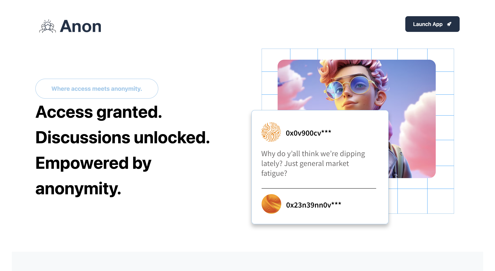

# Anon – Token-Gated Anonymous Forums

**Anon** is a decentralized forum platform that gives NFT holders exclusive access to token-gated discussion spaces. Connect your wallet to Sepolia test network, verify NFT ownership, and chat freely—without usernames, tracking, or noise. Built for DAOs, communities, and private teams that value privacy and signal.

---

## Features

*  **Token-Gated Forums** – Only verified NFT holders can access and post in specific forum spaces.
*  **Anonymous Participation** – Users get an auto generated wallet address to chat with for every forum.
*  **Custom NFT Access** – Create your own access NFTs, whitelist wallet addresses, and spin up private forums, this works best for organizations.

---

##  Getting Started

### 1. Clone the Repo

```bash
git clone https://github.com/your-username/anon.git
cd anon-fe
```

### 2. Install Dependencies

```bash
npm install
```

### 3. Start the Development Server

```bash
npm run dev
```

---

## 🧩 How It Works

1. **Connect Wallet**
   Users connect with MetaMask or WalletConnect to verify ownership of NFTs.

2. **Subscribe to Forums**
   If eligible, users can subscribe to a forum space tied to a specific NFT collection.

3. **Join Conversations**
   Once subscribed, users can post, comment, and react—completely anonymously.

4. **Create Your Own NFT Forum**
   Admins can mint custom NFTs, assign access by wallet address, and create private spaces for teams or communities.

---

## Screenshot



---

## Tech Stack

* **Frontend**: React + TailwindCSS
* **Blockchain**: Solidity, Sepolia + Ethers.js
* **Wallet Auth**: Reown
* **Smart Contracts**: Custom NFT + Access Logic
* **Noir**: NFT Verfication

---

## 🌐 Demo & Docs

* [Live Demo](https://noir-dev-mode.vercel.app/)
* [Pitch Deck](https://gamma.app/docs/Anon-Decentralized-Token-Gated-Anonymous-Forums-i1nmihpcbk1zeys)
* Contractt Address: 0x0473Aa74be1e1f43B3CFD737b892d776985d86Fc (Sepolia deployment) 

---

## Team Members 

- Mayowa Abikoye
- Oluwakemi Atoyebi